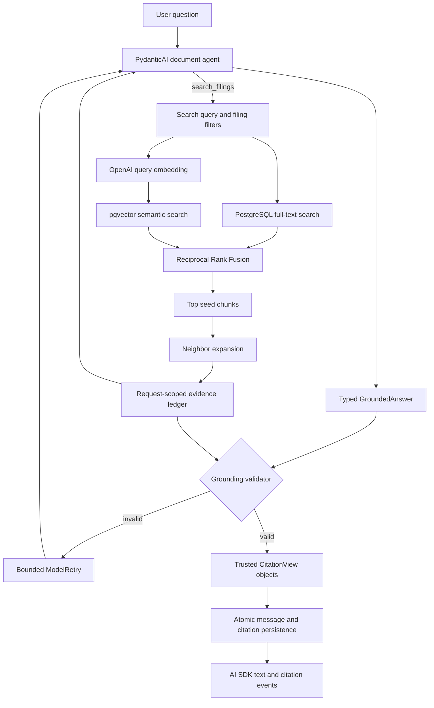
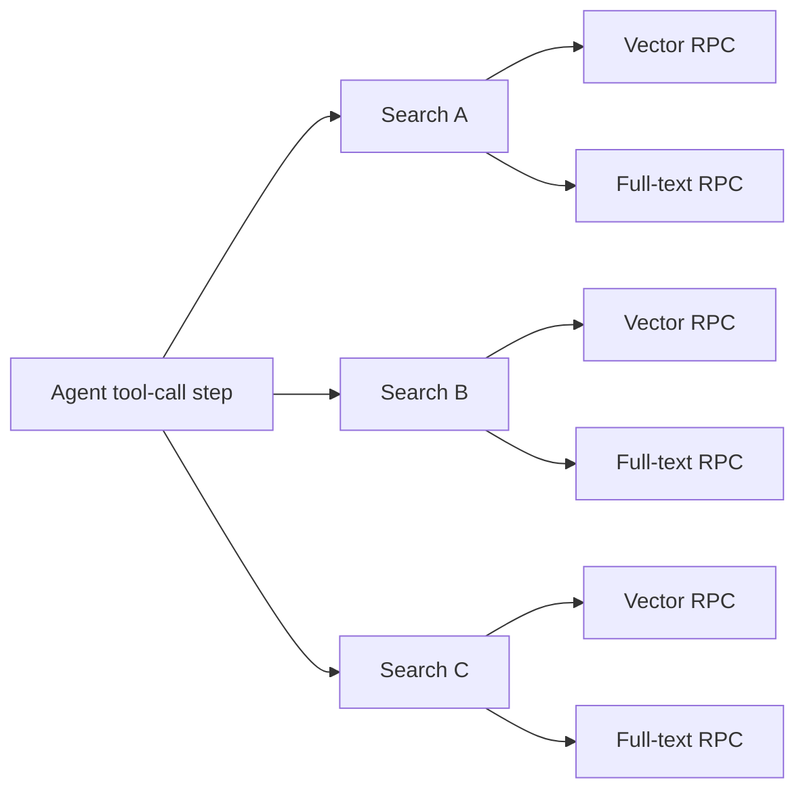

# Retrieval and grounding

This document explains how a user question becomes a citation-validated answer.
For the lower-level search algorithms and database RPCs, see
[`../retrieval/README.md`](../retrieval/README.md).

## Product contract

The assistant may answer only from filing passages retrieved during its current
run. Every substantive line in a grounded answer needs a numbered citation. An
invalid answer is retried and, if it remains invalid, rejected before it reaches
the browser or database.

Grounding is intentionally fail-closed:

- relevant passages do not automatically authorize an unsupported conclusion;
- model-provided filing metadata is never trusted;
- a fluent answer with invalid citations is an error, not a partial success;
- missing or ambiguous evidence produces `insufficient_evidence` rather than a
  guess.

## End-to-end flow



## What happens during retrieval

The user message itself is not chunked. Source filings were chunked during
ingestion; the complete search query is embedded once for each search tool call.

`DocumentRetriever.search()` performs these operations:

1. Validate the query, filters, result limit, and neighbor window.
2. Create one OpenAI embedding for the query.
3. Run semantic pgvector search and PostgreSQL full-text search concurrently.
4. Request up to 30 candidates independently from each search channel.
5. Fuse rank positions using Reciprocal Rank Fusion with `RRF_K = 60`.
6. Select up to eight seed chunks by default.
7. Fetch one preceding and one following chunk around every seed by default.
8. Deduplicate overlapping windows and return citation-ready `SourcePassage`
   objects.

RRF combines ranks, not raw similarity scores. A passage found near the top of
both search channels normally ranks above a passage found by only one channel.

The agent may call retrieval several times with different filters. Every passage
returned by `search_filings` or `read_surrounding_chunks` is added to
`DocumentAgentDeps.evidence`. This dictionary is the authority ledger for that
single run; it is not shared between users or turns.

## Agent tools

The model has three bounded tools:

| Tool | Purpose | Important bound |
| --- | --- | --- |
| `search_filings` | Hybrid search with ticker, filing-type, and year filters | 1–12 requested seed results |
| `read_chunk` | Re-read one chunk already present in the ledger | Cannot access an unseen UUID |
| `read_surrounding_chunks` | Expand an already-seen chunk in its filing | Window 0–2 |

Search-first access prevents the model from inventing a UUID and using it to
browse arbitrary database rows.

## Parallel work

Parallelism currently exists at two useful layers:



- Inside one search, vector and full-text RPCs run concurrently with
  `asyncio.gather()`.
- If the model emits several independent tool calls in one response, PydanticAI
  executes those calls concurrently. The instructions encourage this for
  independent company/year searches.

Dependent work remains sequential. For example, the agent must search before it
can request neighbors for a returned chunk ID.

The application does not currently run several answer-writing LLM agents in
parallel. Doing so would require a second synthesis step and reconciliation of
separate evidence ledgers, citation orders, failures, and usage budgets. It would
also increase cost. The current design keeps one reasoning thread while
parallelizing the expensive independent retrieval I/O underneath it.

Broad questions are bounded by:

| Limit | Value |
| --- | ---: |
| Model requests per turn | 12 |
| Tool calls per turn | 20 |
| Tool argument retries | 2 |
| Grounded-output correction retries | 3 |

These are safety ceilings, not targets.

## How grounding validation works

The model returns a typed `GroundedAnswer`:

```text
status: grounded | insufficient_evidence
answer: text containing [1], [2], ... markers
citations: ordered list of chunk IDs and verbatim excerpts
```

`validate_grounded_answer()` treats that output as untrusted. It verifies:

1. Citation chunk IDs are unique.
2. Every cited chunk exists in the current run's evidence ledger.
3. Every excerpt is an exact substring after conservative whitespace
   normalization.
4. A grounded answer has at least one citation.
5. Every `[n]` marker is in range.
6. Every citation-list entry is used by the answer.
7. Every substantive Markdown line has a citation marker.
8. An insufficient-evidence answer clearly states its limitation.

Trusted display metadata—including company, filing type, date, section, SEC
URL, and optional page—is reconstructed from the stored `SourcePassage`. The
model cannot supply or override that metadata.

The validator proves provenance and citation coverage. It does not prove full
semantic entailment: a real excerpt can still be misinterpreted. The client-
brief evaluations therefore remain necessary human checks.

## Retry and failure behavior

The validator is registered as a PydanticAI output validator. A grounding
violation becomes `ModelRetry`, giving the model up to three correction
attempts. The same deterministic validator runs again in the chat orchestrator
before persistence.

Retrieval has a separate narrow retry for the intermittent Supabase/PostgREST
`PGRST303: JWT issued at future` clock-skew error. It waits 1, 2, and 4 seconds.
No other database error is automatically retried.

If retrieval, generation, grounding, or persistence ultimately fails:

- no answer text or citation is emitted;
- no partial chat turn is stored;
- the UI receives a generic error event;
- internal details remain in backend logs or the diagnostic command.

## Persistence and streaming

After validation, the orchestrator constructs trusted citation parts and calls
the `append_grounded_turn` database RPC. The user message, assistant message,
and ordered `message_citations` rows commit atomically.

Only after that commit does the API stream the validated text and
`data-citation` parts. This means the product deliberately does not forward raw
provider token deltas: text already shown to a user cannot be recalled if later
validation fails.

## Diagnostic commands

Run raw hybrid retrieval from `backend/`:

```powershell
uv run python -m app.retrieval.verify `
  "According to Apple's 2025 10-K, what happened to Services net sales?"
```

Run the complete read-only agent and grounding path:

```powershell
uv run python -m app.grounding.verify `
  "According to Apple's 2025 10-K, what happened to Services net sales?"
```

The grounding command uses the real model and corpus, but it does not authenticate
a browser user, stream through FastAPI, or persist a chat turn. It prints:

- final grounding status;
- evidence and citation counts;
- the answer;
- trusted citation metadata and verbatim excerpts;
- the full evidence ledger, labelled as cited or merely available.

Run the fast unit tests without network access:

```powershell
uv run pytest tests/retrieval tests/grounding tests/assistant -m "not integration" -q
```

## Reading common results

| Result | Meaning |
| --- | --- |
| `GROUNDING VALIDATION: PASSED`, `grounded` | A cited answer passed every structural provenance check. |
| `GROUNDING VALIDATION: PASSED`, `insufficient_evidence` | The agent safely declined or limited its conclusion. |
| Evidence ledger is larger than citation count | The agent inspected passages it did not need to cite. |
| `page unknown` | HTML extraction did not preserve a reliable page; section, URL, chunk ID, and excerpt remain available. |
| Maximum output retries exceeded | All bounded drafts violated at least one grounding rule. |
| Usage limit exceeded | The agent exhausted its model-request or tool-call safety budget. |
