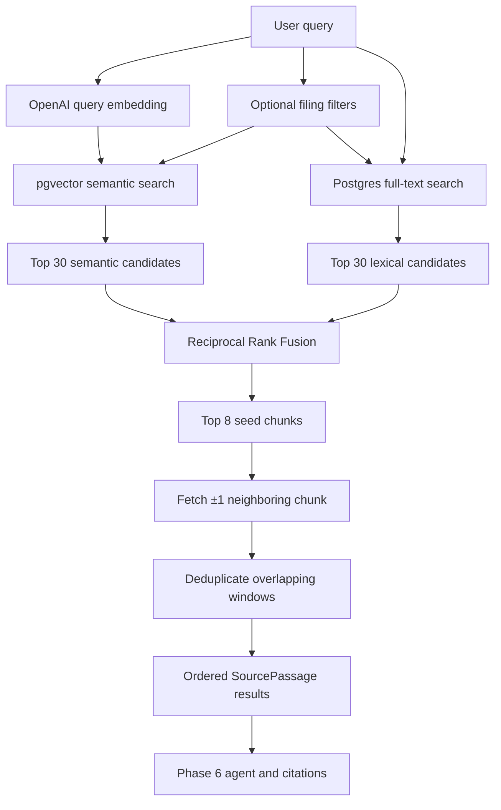

# Retrieval pipeline

This package implements hybrid retrieval over the ingested SEC filing corpus.
It combines semantic similarity from pgvector with PostgreSQL full-text search,
fuses the two rankings in Python, and expands the strongest matches with nearby
chunks from the same filing.

For the agent, evidence ledger, citation validator, persistence, streaming, and
parallel-search behavior built on top of retrieval, see
[`../grounding/README.md`](../grounding/README.md).

The public entry point is `DocumentRetriever.search()` in `retriever.py`.

## Pipeline



## Default settings

The initial defaults live in `retriever.py`:

| Setting | Default | Purpose |
| --- | ---: | --- |
| `DEFAULT_CANDIDATE_LIMIT` | `30` | Number of candidates requested independently from semantic and full-text search. |
| `DEFAULT_RESULT_LIMIT` | `8` | Maximum number of fused seed chunks selected before neighbor expansion. |
| `DEFAULT_NEIGHBOR_WINDOW` | `1` | Fetch one preceding and one following chunk from the same document. |
| `RRF_K` | `60` | Smoothing constant used by Reciprocal Rank Fusion. |

These are code constants rather than environment variables. They should only
be changed after evaluating retrieval quality against the client-brief
questions.

The query embedding uses the shared application settings:

| Environment setting | Current default | Purpose |
| --- | --- | --- |
| `OPENAI_EMBEDDING_MODEL` | `text-embedding-3-small` | Must match the model used during ingestion. |
| `OPENAI_EMBEDDING_DIMENSIONS` | `1536` | Must match the `vector(1536)` database column and stored embeddings. |

Changing either embedding setting requires re-embedding the corpus. Query and
document embeddings produced by different models or dimensions are not
compatible.

## Search stages

### 1. Query embedding

`DocumentRetriever` sends the stripped query to OpenAI once and verifies that
exactly one embedding with the configured dimensions is returned.

Blank queries, non-positive result limits, negative neighbor windows, and
invalid embedding dimensions fail before database retrieval.

### 2. Independent database searches

After embedding, the two database searches run concurrently with
`asyncio.gather()`.

Semantic search calls the `match_document_chunks_semantic` Supabase RPC. It
orders chunks by pgvector cosine distance using the `<=>` operator and exposes
`1 - distance` as a diagnostic similarity score.

Full-text search calls `match_document_chunks_full_text`. PostgreSQL parses the
question with `websearch_to_tsquery('english', query)` and ranks matches with
`ts_rank_cd` over the generated `search_vector` column.

`websearch_to_tsquery` is not exact-string matching. With the `english`
configuration it tokenizes text, removes English stop words, normalizes words
to lexemes, and supports familiar web-search syntax:

- unquoted terms are combined with `AND`;
- quoted text becomes a phrase constraint;
- `OR` creates alternatives;
- a leading `-` excludes a term.

The stored `search_vector` is generated with
`to_tsvector('english', content)`, so query and document text receive the same
linguistic normalization. However, the default `AND` behavior means a long
natural-language question can still be too restrictive when its meaningful
terms do not all occur in one chunk.

In the product path, the complete user message is given to the PydanticAI
agent. The agent then supplies a shorter evidence-oriented `query` to
`search_filings`; there is no separate keyword-extraction LLM call. Tool
instructions require focused phrases and separate searches for independent
topics. Calling `DocumentRetriever.search()` directly still passes its input
unchanged to both the embedding and full-text channels.

The two scores are deliberately not compared or averaged. Cosine similarity
and full-text rank have unrelated scales.

### 3. Reciprocal Rank Fusion

`reciprocal_rank_fusion()` combines rank positions rather than raw scores:

```text
RRF(chunk) = sum(1 / (60 + rank))
```

A chunk appearing near the top of both searches normally outranks a chunk
found by only one channel. Duplicate chunk IDs within one channel count once.
Ties use deterministic first-seen ordering so tests and responses remain
stable.

### 4. Neighbor expansion

The top fused chunks become seeds. `get_document_chunk_window` retrieves chunks
from the same filing whose indexes fall inside the configured window.

With the default window of `1`, a seed at index 12 can return indexes 11, 12,
and 13. Chunks never cross a document boundary.

Neighboring windows may overlap, so Python deduplicates results by chunk ID.
When a neighbor belongs to several windows, it is associated with the
highest-ranked seed. Seed chunks retain their RRF score and neighbors inherit
the score of the seed that selected them.

The returned `is_seed` field distinguishes direct search matches from added
context.

## Filters

`RetrievalFilters` applies the same constraints to both search channels:

- `tickers`: zero or more ticker symbols; normalized to uppercase.
- `filing_types`: zero or more filing types such as `10-K`.
- `fiscal_year_from`: inclusive lower year bound.
- `fiscal_year_to`: inclusive upper year bound.

An empty tuple or `None` year becomes SQL `NULL`, meaning no restriction for
that field.

Filters are explicit inputs. Phase 5 does not use an LLM to infer companies or
years from the question. The Phase 6 agent will pass structured filters through
its `search_filings` tool.

## Returned passages

`DocumentRetriever.search()` returns `SourcePassage` objects containing:

- stable chunk and document UUIDs;
- chunk index and full passage text;
- page and section when available;
- ticker, company, filing type, filing date, report date, and fiscal year;
- SEC accession number and source URL;
- fused RRF score;
- whether the passage is a seed or neighbor.

Chunk IDs remain intact instead of concatenating neighboring text into a
synthetic passage. This allows Phase 6 citations to reference real
`document_chunks.id` records.

An empty list means neither channel found a candidate under the supplied
filters. If either channel fails operationally, the complete retrieval call
fails rather than silently switching to single-channel behavior.

## Database functions and indexes

The RPC functions are created by
`alembic/versions/20261003_0003_retrieval_functions.py`:

- `match_document_chunks_semantic`
- `match_document_chunks_full_text`
- `get_document_chunk_window`

They are `SECURITY INVOKER` functions, so they run with the caller's database
permissions and RLS context. Execution is granted to `authenticated` and
`service_role`, not `PUBLIC`.

The semantic query uses the HNSW index on `document_chunks.embedding`. The
lexical query uses the GIN index on `document_chunks.search_vector`.

## Trying it manually

From `backend/`, run:

```powershell
uv run python -m app.retrieval.verify `
  "How did Apple's revenue mix between iPhone and Services change?" `
  --ticker AAPL `
  --filing-type 10-K `
  --year-from 2021 `
  --year-to 2025
```

Use `--neighbor-window 0` to inspect only fused seed chunks:

```powershell
uv run python -m app.retrieval.verify `
  "AWS operating income and margin" `
  --ticker AMZN `
  --limit 5 `
  --neighbor-window 0
```

Repeat `--ticker` or `--filing-type` to supply multiple values. Run
`uv run python -m app.retrieval.verify --help` for all options.

The command is read-only, but it requires configured Supabase and OpenAI
credentials. It prints seed/neighbor status, RRF score, filing metadata, chunk
identity, source URL, and a passage excerpt.

To continue past retrieval and inspect a real agent answer plus the complete
grounding evidence ledger, run:

```powershell
uv run python -m app.grounding.verify `
  "According to Apple's 2025 10-K, what happened to Services net sales?"
```

That command prints the structured answer, validated citations, every chunk the
agent retrieved or expanded during the run, and whether each chunk was cited.
It exits with an error if the final answer fails the same grounding validator
used by the application.

## Tests

Run the fast retrieval suite without external services:

```powershell
uv run pytest tests/retrieval -m "not integration" -q
```

Run the real Supabase/OpenAI check explicitly:

```powershell
uv run pytest tests/retrieval/test_integration.py -m integration -q
```

Test responsibilities:

- `test_fusion.py`: RRF calculation, duplicates, ties, and empty rankings.
- `test_queries.py`: Supabase RPC parameters, filter assembly, and row parsing.
- `test_retriever.py`: embedding, parallel search orchestration, fusion order,
  neighbor expansion, deduplication, and input failures.
- `test_verify.py`: manual CLI argument parsing and readable output.
- `test_integration.py`: a real filtered query against the ingested corpus.

## Module map

| Module | Responsibility |
| --- | --- |
| `models.py` | Retrieval filters and typed result objects. |
| `queries.py` | Supabase RPC calls and external-row parsing. |
| `fusion.py` | Pure deterministic Reciprocal Rank Fusion. |
| `retriever.py` | End-to-end retrieval orchestration. |
| `verify.py` | Read-only terminal command for inspecting real passages. |
